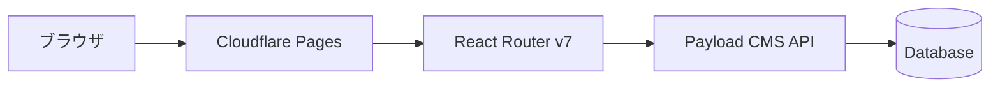

# サイト構成

現在はシンプルなフロントエンドのみの構成です。将来的にCMSを導入する予定があります。

## 現在の構成


## 将来的な構成（CMS導入後）



## 各部分の役割

### フロントエンド（現在）

- **フレームワーク**: React Router v7
- **デプロイ**: Cloudflare Pages
- **スタイリング**: Tailwind CSS + Shadcn/ui
- **データ**: コード内に直接記述（仮データ）

現在は記事データをコード内に書いています。記事が増えてきたらCMSの導入を検討します。

### バックエンド（将来的に導入予定）

- **CMS**: Payload CMS v3
- **デプロイ**: AWS App Runner / GCP Cloud Run（無料枠を活用）
- **データベース**: MongoDB Atlas（無料枠）

### なぜ最初からCMSを入れないのか？

1. **コストを抑えたい**: CMSのホスティングには月額費用がかかる可能性がある
2. **シンプルに始めたい**: まずは記事を書くことに集中
3. **必要になってから**: 記事が10-20本溜まってから導入しても遅くない

## デプロイ方法

### 現在の方法

1. GitHubにプッシュ
2. Cloudflare PagesがGitHub連携で自動ビルド・デプロイ
3. 完了（特に設定不要）

### ローカルでのデプロイ

```bash
npm run deploy
```

これで`wrangler`を使ってCloudflare Pagesにデプロイできます。
