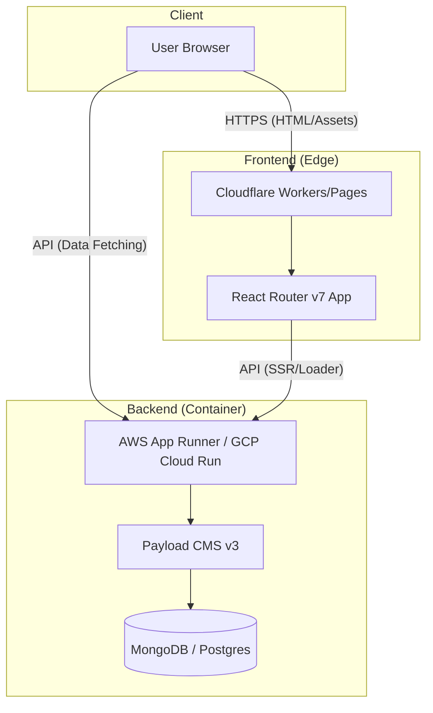

# System Architecture

本プロジェクトは、フロントエンド（Web）とバックエンド（CMS）を完全に分離した **Headless Architecture** を採用しています。

## 🧩 Architecture Diagram

```mermaid
graph TD
    subgraph "Frontend (Edge)"
        CF[Cloudflare Workers/Pages]
        RR[React Router v7 App]
        CF --> RR
    end

    subgraph "Backend (Container)"
        Cloud[AWS App Runner / GCP Cloud Run]
        Payload[Payload CMS v3]
        DB[(MongoDB / Postgres)]

        Cloud --> Payload
        Payload --> DB
    end

    subgraph "Client"
        Browser[User Browser]
    end

    Browser -- HTTPS (HTML/Assets) --> CF
    Browser -- API (Data Fetching) --> Cloud
    RR -- API (SSR/Loader) --> Cloud
```

## 🏗 Component Roles

### 1. Frontend: `apps/web`

- **Role**: ユーザーインターフェース、3Dモデルのレンダリング、ルーティング。
- **Framework**: React Router v7 (Framework Mode)
- **Deployment**: Cloudflare Workers/Pages (Pages Functions)
- **Runtime**: Cloudflare Workers (using `@react-router/cloudflare` adapter)
- **Mechanism**:
  - `loader` 関数を使用し、サーバーサイド（Edge）でCMSからデータを取得。
  - Cloudflareのエッジネットワークを活用し、低遅延でコンテンツを配信。
  - React Three Fiber (R3F) を用いたインタラクティブな製品デモの実装。

### 2. Backend / CMS: `apps/cms`

- **Role**: コンテンツ管理、API提供、将来的なユーザー認証・決済処理の基盤。
- **Framework**: Payload CMS v3 (Running on Node.js/Next.js adapter)
- **Deployment**: Docker Container (AWS App Runner or GCP Cloud Run)
- **Database**: MongoDB Atlas or Managed Postgres
- **Why Separate?**:
  - フロントエンドの技術（Cloudflare/React）に依存せず、データを永続化するため。
  - SaaS型CMS（MicroCMS等）の制限を受けず、バックエンドロジック（Stripe連携など）を自由に拡張するため。

## 🚀 Deployment Strategy

GitHub Actions (または各プラットフォームのGit連携) を利用したCI/CDを構築。

1. **Frontend**: `main` ブランチへのプッシュをトリガーに Cloudflare Workers/Pages がビルド・デプロイ。
   - `wrangler pages deploy` を使用してCloudflare Workersランタイム上でSSRを実行。
2. **Backend**: `main` ブランチへのプッシュをトリガーに Dockerイメージを作成し、コンテナ環境へデプロイ。
